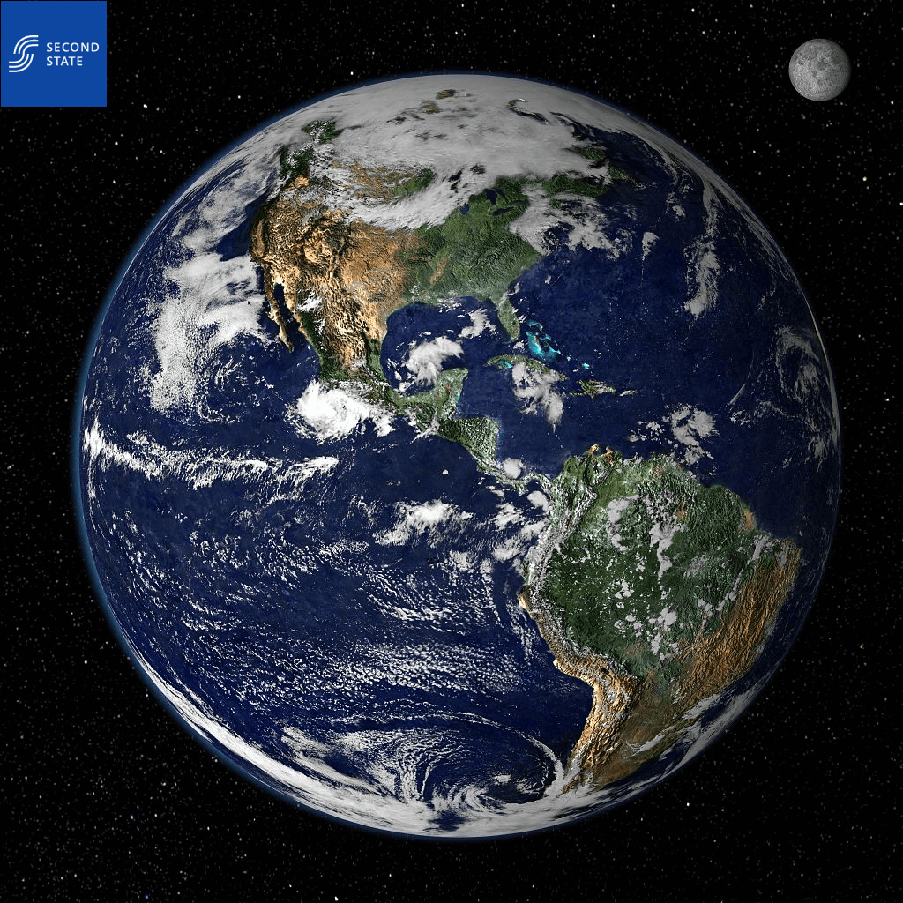

# Server-side image watermarking

The benefits of this watermarking service include:

- the watermarking can be commissioned by a client who does not have the images at hand (images can be fetched and stored remotely i.e. to and from S3)
- the watermarking can be performed on more than one image, in parallel (calls to this function are made via HTTP request via Joey)
- the watermarking can be performed on individual frames of a video (passed in either in parallel or in real time)
- the watermarking takes place on the server-side and takes advantage of high performance hardware
- the watermarking does not rely on third party dependencies (processes raw bytes)
- the processing of the raw bytes is performed exclusively by SSVM (stand alone stack-based WebAssembly (Wasm) Virtual Machine)

## Function Name
This Rust code has the following function name
```
watermark_single_image
```

## Function Parameters
This Rust code accepts the following parameters:
```
(_image_width: u32, _image_height: u32, mut _image_pixels: Vec<u8>, _watermark_width: u32, _watermark_height: u32, mut _watermark_pixels: Vec<u8>, _watermark_pos_width: u32, _watermark_pos_height: u32)
```
Explaination of the parametersis as follows:

**original image**

- _image_width, the pixel width of the image to be watermarked
- _image_height, the pixel height of the image to be watermarked
- _image_pixels, the image as a byte array

**watermark image**

- _watermark_width, the pixel width of the watermark image to be laid over the original
- _watermark_height, the pixel height of the watermark image to be laid over the original
- _watermark_pixels, the watermark as a byte array

**positioning information**

- _watermark_pos_width, the horizontal position of where the watermark should start to be overlaid i.e. pixel 1
- _watermark_pos_height, the vertical position of where the watermark should start to be overlaid i.e. pixel 1


If `_watermark_pos_width` is set to `1` and `_watermark_pos_height` is set to `1` then the watermark would be place in the top left corner like this.




Image attribution 
```
NASA/GSFC/Reto Stöckli, Nazmi El Saleous, and Marit Jentoft-Nilsen / Public domain
```
# Build your own
Create a new Rust project
```
cargo new --lib watermark
```
Edit the Cargo.toml file (add the **lib** and **dependencies** sections as per the following example)
```
[lib]
name = "watermark"
path = "src/lib.rs"
crate-type =["cdylib"]

[dependencies]
wasm-bindgen = "=0.2.61"
```
Edit the `src/lib.rs` source code file (add the following code)
```
use std::collections::HashMap;
  
#[derive(Debug)]
struct Pixel {
    r: u8,
    g: u8,
    b: u8,
    t: u8,
}
#[wasm_bindgen]
pub fn watermark_single_image(_image_width: u32, _image_height: u32, mut _image_pixels: Vec<u8>, _watermark_width: u32, _watermark_height: u32, mut _watermark_pixels: Vec<u8>, _watermark_pos_width: u32, _watermark_pos_height: u32) -> Vec<u8> {
    let mut pixels = HashMap::new();
    let mut width: u32 = _watermark_width;
    let mut height: u32 = _watermark_height;
    if _watermark_pos_width + _watermark_width > _image_width {
        width = _image_width - _watermark_pos_width;
    }
    if _watermark_pos_height + _watermark_height > _image_height {
        height = _image_height - _watermark_pos_height;
    }
    for w_h in 0..height{
        let height_start_pixel = (width * 4) * w_h;
        for w_w in 0..width{
            let width_start_pixel_at_byte = height_start_pixel + (w_w * 4);
            let temp_pixel = Pixel {r: _watermark_pixels[width_start_pixel_at_byte as usize], g:_watermark_pixels[width_start_pixel_at_byte as usize + 1], b:_watermark_pixels[width_start_pixel_at_byte as usize + 2], t:_watermark_pixels[width_start_pixel_at_byte as usize + 3]};
            let watermark_key = format!("{}{}{}", w_w.to_string(), "_".to_string(), w_h.to_string());
            pixels.insert(watermark_key, temp_pixel);
        }
    }
    let mut w_counter: u32 = 0;
    let mut h_counter: u32 = 0;
    let height_limit = _watermark_pos_height + height;
    let width_limit = _watermark_pos_width + width;
    for i_h in _watermark_pos_height..height_limit {
        let height_start_pixel_2 = (_image_width * 4) * i_h;
        for i_w in _watermark_pos_width..width_limit {
            let width_start_pixel_at_byte_2 = height_start_pixel_2 + (i_w * 4);
            let image_key = format!("{}{}{}", w_counter.to_string(), "_".to_string(), h_counter.to_string());
            match pixels.get(&image_key) {
                Some(pixel) => {
                    _image_pixels[width_start_pixel_at_byte_2 as usize] = pixel.r;
                    _image_pixels[width_start_pixel_at_byte_2 as usize + 1] = pixel.g;
                    _image_pixels[width_start_pixel_at_byte_2 as usize + 2] = pixel.b;
                    _image_pixels[width_start_pixel_at_byte_2 as usize + 3] = pixel.t;
                },
                None => println!("Not found")
            }
            w_counter = w_counter + 1;
        }
        w_counter = 0;
        h_counter = h_counter + 1;
    }
    _image_pixels.clone()
}
```
Build using `ssvmup build`
```
ssvmup build
```
Deploy to Joey
```
curl --location --request POST 'https://rpc.ssvm.secondstate.io:8081/api/executables' \
--header 'Content-Type: application/octet-stream' \
--header 'SSVM_Description: watermark' \
--data-binary '@/Users/tpmccallum/watermark_bg.wasm'
```
Returns
```
{"wasm_id":23,"wasm_sha256":"0x0b64a86946a4e578f6968de020534ed936fb08305fa9138acf218fff0b86a50c","SSVM_Usage_Key":"00000000-0000-0000-0000-000000000000","SSVM_Admin_Key":"bbfd10e2-be2b-430a-b779-a88df608f979"}
```
```
